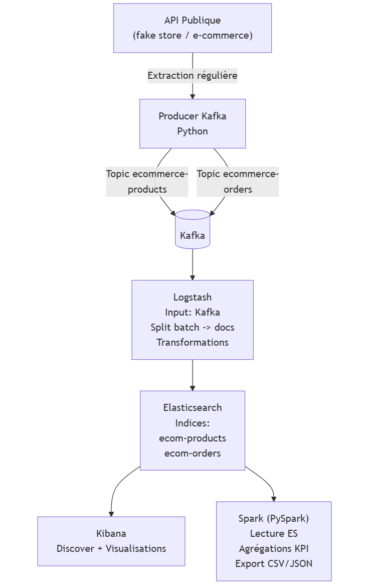

# E-commerce Data Pipeline

End-to-end data pipeline for e-commerce data using **Kafka, Logstash, Elasticsearch, Kibana and Spark**.



## Description
This project implements a complete data pipeline:
- Data collection (cron / producer)
- Streaming with Kafka
- Transformation and indexing with Logstash + Elasticsearch
- Visualization with Kibana
- Distributed processing with Spark

For full technical details, architecture, queries and results, see:  
[Projet_Data_Pipeline_Indexation_et_visualisation_de_données_massives.pdf](Projet_Data_Pipeline_Indexation_et_visualisation_de_données_massives.pdf)

## Run the project
Start the full stack with Docker:

```bash
docker-compose up -d
```
Stop everything:
```
docker-compose down
```
